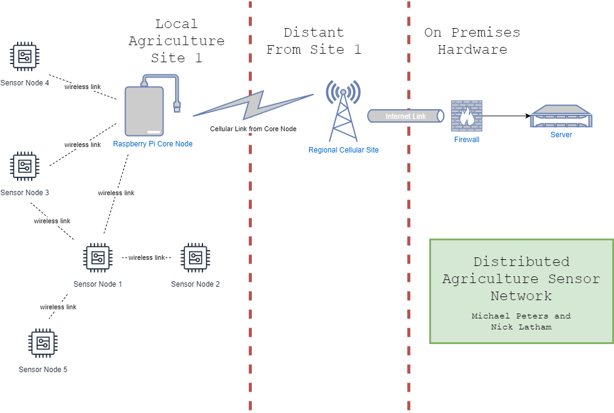

# DistributedAgriculturalSensorNetwork
This is a repository for our Senior Design proposal for a distributed sensor network and easy-to-use UI to make improved decisions based upon local microclimate information.
> a collection of pre-proposal ideas and documents.



## Installation
```
git clone https://github.com/michaelpeterswa/DistributedAgriculturalSensorNetwork.git
```
Or download the file manually.
## Release History
* 0.0.1
   * Opened Repository (02.28.2020)
## Meta
Michael Peters and Nick Latham - @michaelpeterswa & @nlatham1999

Distributed under the MIT license. See ``LICENSE`` for more information.
